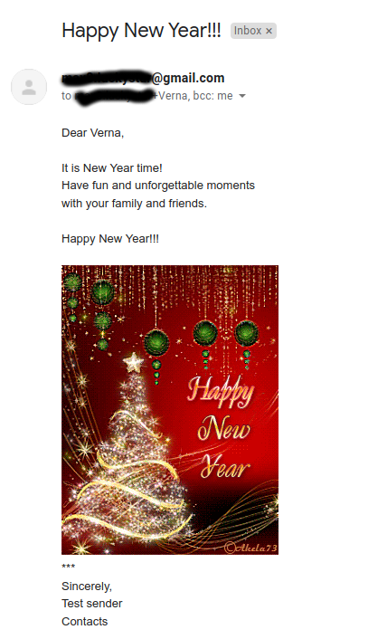
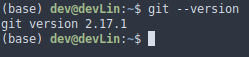
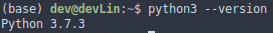
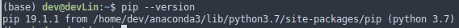
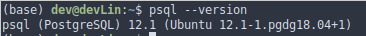
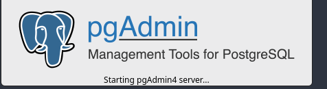
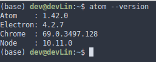
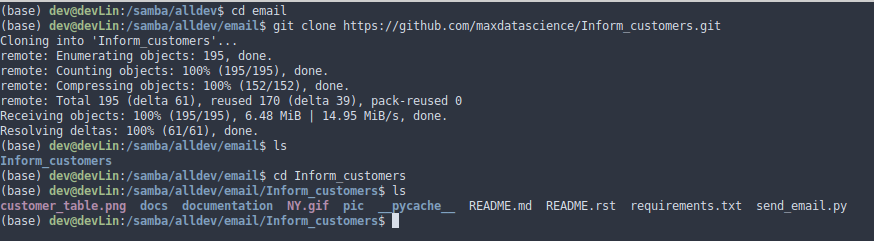

title: Customer messaging system

Inform customer about new features by sending emails

**Input:** list of names, emails, message template, default signature,
default subject

**Output:** email message is sent to the customer, example below

> 

Table of content
================

-   Description
    -   Problem
    -   Goal
    -   Solution
        -   View customer
        -   Table email\_template
            -   Sample template for email body
            -   Sample subject
            -   Sample signature
        -   Program module
-   Getting Started
-   Prerequisites
-   Installing
    -   Install and Run GitHub
    -   Install Python 3
    -   Install package manager `pip`
    -   Set up virtual environment
        -   Create virtual environment for project
    -   Set up and Run PostgreSQL
    -   Set up PgAdmin 4
    -   Text editor
    -   Clone repository from GitHub to environment
    -   Create PostgreSQL Database Views an Tables mentioned in the
        **Solution**
    -   Make sure the Tables and Views contain necessary data to work
        with
    -   Install necessary packages
-   Run tests to check everything is working properly

Credits

Description
-----------

### Problem

Customers should be informed about new features available for them.
System should send automatic emails to customers allowing sending event
information (like New Year congratulations and invitations) as well.

### Goal

Create View for list of customers for email sending. Create customizable
template for each event that is stored in the PostgreSQL database. Send
emails by filling out the necessary parameters: **sender email**
<example@gmail.com> **sender SMTP** SMTP server, SMTP port. Default
settings for gmail.com are filled out.

### Solution

Design Database structure for keeping the clients information and email
templates.

#### View `customer`

Create View in the PostgreSQL database for keeping customer's
information with the following structure

<table style="width:75%;">
<colgroup>
<col style="width: 13%" />
<col style="width: 19%" />
<col style="width: 20%" />
<col style="width: 20%" />
</colgroup>
<tbody>
<tr class="odd">
<td>id_addr</td>
<td>first_name</td>
<td><blockquote>

email

</blockquote></td>
<td><blockquote>

email_work

</blockquote></td>
</tr>
<tr class="even">
<td>integer</td>
<td>varchar(45)</td>
<td>varchar(355)</td>
<td>varchar(355)</td>
</tr>
</tbody>
</table>

-   **id\_addr** client's unique id
-   **first\_name** client's first name
-   **email** personal client's email
-   **email\_work** client's work email

**columns could be named differently** - in this case correct the
program by putting your column names instead of those mentioned above
accordingly.

#### Table `email_template`

Create table in the PostgreSQL database for keeping email templates with
the following structure

<table style="width:62%;">
<colgroup>
<col style="width: 13%" />
<col style="width: 11%" />
<col style="width: 20%" />
<col style="width: 16%" />
</colgroup>
<tbody>
<tr class="odd">
<td><blockquote>

id

</blockquote></td>
<td>templ</td>
<td><blockquote>

subject

</blockquote></td>
<td>signature</td>
</tr>
<tr class="even">
<td>integer</td>
<td>text</td>
<td>varchar(255)</td>
<td><blockquote>

text

</blockquote></td>
</tr>
</tbody>
</table>

-   **id** email template unique id
-   **templ** html email template
-   **subject** subject line for emails
-   **signature** signature to put in the email

##### Sample template for email body (column *templ*)

-   \<html\>
-   \<head\>\</head\>
-   \<body\>
-   \<p\>
-   Dear ${PERSON\_NAME},\<br\>
-   \<br\>
-   It is New Year time!\<br\>
-   Have a fun and unforgettable moments\<br\>
-   with your family and friends.\<br\>\<br\>
-   Happy New Year!!!\<br\>\<br\>
-   \"\>\<br\>
-   ${SIGNATURE}\<br\>
-   \</p\>
-   \</body\>
-   \</html\>

##### Sample subject (column *subject*)

-   Happy New Year!!!

##### Sample signature (column *signature*)

-   \<br\>
-   Sincerely,\<br\>
-   Test sender\<br\>
-   Contacts\<br\>

#### Program module

-   Set up database connection credentials.
-   Set up your email connection credentials
-   Get template and default elements like subject, signature from
    PostgreSQL database
-   Get list of name, email for sending email from PostgreSQL database
-   Construct personalized email for everybody on the list
-   Send personalized email using gmail.com service

For testing purposes use **test=True** parameter with Email class to
send email to yourself

> For class' description and more details please see documentation

Getting Started
---------------

These instructions will get you a copy of the project up and running on
your local machine for testing purpose. See deployment part for notes on
how to deploy the project on a live system.

Prerequisites
-------------

-   Linux - Ubuntu
-   GitHub
-   Python v 3.x
-   pip (package manager)
-   Virtual environment package 'venv' to distinguish the project from
    other ones
-   PostgreSQL (v12.1 preferably)
-   PgAdmin 4
-   Gmail account (default) or other email account and necessary
    information to set it up
-   Terminal

Installing
----------

Feel free to skip the step if you already have the tool installed

### Install and Run GitHub

> `` ` sudo apt-get update sudo apt-get install git `` class="title-ref"> verify the installation was successful by typing
> \`github --version
>
> 

### Install Python 3

> Python 3 is installed in Linux. verify the installation by typing
> python3 --version
>
> 

### Install package manager `pip`

> `` ` sudo apt-get update sudo apt-get install python3-pip `` class="title-ref"> verify the installation was successful by typing
> \`pip --version
>
> 

### Set up virtual environment

> `` ` sudo apt-get install python3-venv ``\`

#### Create virtual environment for project

Create and activate virtual environment

:   `` ` python -m venv ./venv/project-folder source bin/activate `` as the virtual environment is activated you'll
    see the name of your environment first in the command prompt like
    where \`send\_email is the name of the virtual environment

    

### Set up and Run PostgreSQL

> Follow the process described here [postgresql]():
>
> verify the installation was successful by typing  class="title-ref">psql --version
>
> 

### Set up PgAdmin 4

> Follow the process described here [pgadmin]():
>
> verify the installation was successful by typing  class="title-ref">pgAdmin4. it start the pgAdmin4 server
>
> 

### Text editor

> Use the one you love or you can install atom
> `` ` pip install atom `` verify the
> installation was successful by typing \`atom --version
>
> 

### Clone repository from GitHub to environment

> `` ` git clone link-to-repository ``\` verify that you have the
> project in your folder you should see something like
>
> 

### Create PostgreSQL Database Views an Tables mentioned in the **Solution**

Run pgAdmin4 and create database, tables and Views - Follow the process
described in
[documentation](https://www.pgadmin.org/docs/pgadmin4/4.16/index.html):

### Make sure the Tables and Views contain necessary data to work with

> Run pgAdmin4 and execute SQL statement
> `` ` SELECT * FROM customer LIMIT 1; `` The
> query should return 1 row
> `SELECT * FROM email_template LIMIT 1;`\` The query should
> return 1 row

### Install necessary packages

> `` ` pip install -r Inform_customers/requirements.txt ``\`

**Congratulations, your environment is ready to test!!!**

Run tests to check everything is working properly
-------------------------------------------------

Credits
=======

Thanks to Akela73 for providing NY.gif picture form emails.

To do
=====

Include columns into database: `image_filename`, `image_blob` to keep
image in the database
